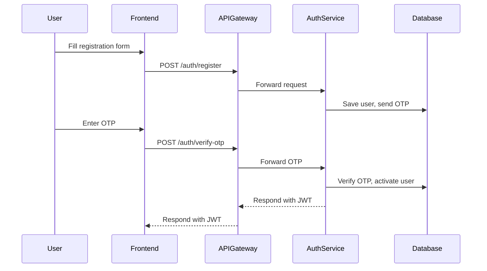

# Medicart-FS Auth Service: Complete Overview

This document explains the entire flow and architecture of the Medicart-FS Auth Service, from user registration and login to password management and JWT authentication. It covers the main components, endpoints, and how everything works together.

---

## 1. What is the Auth Service?
- The Auth Service is a Spring Boot microservice responsible for user authentication, registration, password management, OTP verification, and JWT token generation.
- It is a core part of the Medicart-FS microservices architecture.

---

## 2. Main Features
- **User Registration (with OTP verification)**
- **User Login (JWT token issued)**
- **Forgot Password & Reset Password (OTP/token based)**
- **Change Password (for logged-in users)**
- **JWT Token Generation and Validation**
- **Role-based access (ROLE_USER, ROLE_ADMIN)**

---

## 3. Key Components
- **Controllers:** Handle HTTP requests (AuthController, OtpController, etc.)
- **Services:** Business logic (AuthService, JwtService, OtpService)
- **Entities:** User, Role
- **Repositories:** UserRepository, RoleRepository
- **Config:** Security, password encoding, data initialization
- **Exception Handling:** GlobalExceptionHandler

---

## 4. Registration Flow
1. User submits registration form (email, password, phone, etc.).
2. AuthController receives the request and calls AuthService.
3. AuthService checks if the email exists, encrypts the password, creates a new user, and sends an OTP.
4. User verifies OTP via OtpController.
5. On successful OTP verification, user is activated and receives a JWT token.

---

## 5. Login Flow
1. User submits login form (email, password).
2. AuthController receives the request and calls AuthService.
3. AuthService verifies credentials and generates a JWT token if valid.
4. JWT token is returned to the frontend for authenticated requests.

---

## 6. Forgot/Reset Password Flow
1. User requests password reset (forgot password).
2. AuthController triggers OtpService to send OTP/token to user's email.
3. User submits OTP/token and new password.
4. AuthService verifies OTP/token and updates the password.

---

## 7. Change Password Flow
1. Logged-in user submits old and new password.
2. AuthController verifies the old password and updates to the new password if correct.

---

## 8. JWT Token Handling
- **Generation:** JwtService creates JWT tokens with user info and roles.
- **Validation:** API Gateway checks JWT signature before forwarding requests to backend services.
- **Usage:** JWT is sent in the Authorization header for all protected endpoints.

---

## 9. Role Management
- **ROLE_USER:** Default for all new users.
- **ROLE_ADMIN:** For admin users (created by DataInitializer at startup).
- Roles are used for access control in the system.

---

## 10. Data Initialization
- On startup, DataInitializer ensures:
  - ROLE_USER and ROLE_ADMIN exist.
  - Default admin user (admin@medicart.com / admin123) exists and has correct password.

---

## 11. Exception Handling
- GlobalExceptionHandler catches and formats errors for all endpoints.

---

## 12. Key Files and Their Purpose
| File/Folder | Purpose |
|-------------|---------|
| controller/ | Handles HTTP requests (AuthController, OtpController, etc.) |
| service/    | Business logic (AuthService, JwtService, OtpService) |
| entity/     | Data models (User, Role) |
| repository/ | Database access (UserRepository, RoleRepository) |
| config/     | Security, password encoding, data initialization |
| exception/  | Global error handling |

---

## 13. Security
- Passwords are always encrypted using BCrypt.
- JWT tokens are signed with a secret key.
- Only authenticated users can access protected endpoints.

---

## 14. How Everything Connects
- **Frontend** sends requests to **API Gateway**.
- **API Gateway** validates JWT and forwards to **Auth Service**.
- **Auth Service** handles registration, login, password, and OTP logic.
- **Database** stores users and roles.

---

## 15. Sequence Diagram (Registration Example)

---

This document gives you a complete, beginner-friendly overview of the Medicart-FS Auth Service, its flows, and how all parts work together.
