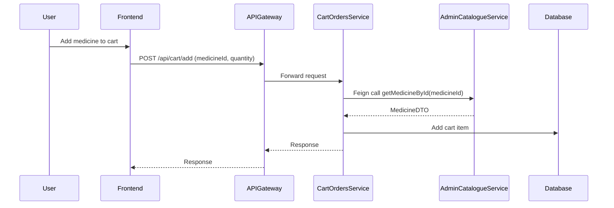

# Feign Client Example in Medicart-FS (Cart Orders Service)

This document explains how Feign Client is used in the Cart Orders Service to communicate with the Admin Catalogue Service. It includes a real example, complete flow, and code snippets.

---

## What is Feign Client?
- Feign Client is a declarative REST client for Java/Spring Boot.
- It allows you to call other microservices as if they were local methods, without writing manual HTTP code.
- In Medicart-FS, Feign is used to fetch medicine and batch details from the Admin Catalogue Service.

---

## Example: Add to Cart (Fetch Medicine Details)

### Flow
1. User sends a request to add a medicine to their cart.
2. CartController receives the request.
3. CartController uses MedicineClient (a Feign Client) to fetch medicine details from the Admin Catalogue Service.
4. CartService adds the item to the cart using the fetched details.

---

### Sequence Diagram


---

### Key Code Snippets

#### 1. Feign Client Interface
**File:** `microservices/cart-orders-service/src/main/java/com/medicart/cartorders/client/MedicineClient.java`
```java
@FeignClient(name = "admin-catalogue-service")
public interface MedicineClient {
    @GetMapping("/medicines/{id}")
    MedicineDTO getMedicineById(@PathVariable("id") Long medicineId);
}
```
- This interface defines a Feign Client for the Admin Catalogue Service.
- The method getMedicineById will make a GET request to `/medicines/{id}` on the admin-catalogue-service.

#### 2. Controller Usage
**File:** `microservices/cart-orders-service/src/main/java/com/medicart/cartorders/controller/CartController.java`
```java
@Autowired
private MedicineClient medicineClient;

@PostMapping("/add")
public ResponseEntity<CartItemDTO> addToCart(
        @RequestHeader(value = "X-User-Id", required = false) Long userId,
        @RequestParam Long medicineId,
        @RequestParam Integer quantity) {
    if (userId == null) {
        return ResponseEntity.status(HttpStatus.UNAUTHORIZED).build();
    }
    MedicineDTO medicineDTO = medicineClient.getMedicineById(medicineId);
    if (medicineDTO == null) {
        return ResponseEntity.badRequest().build();
    }
    CartItemDTO cartItem = cartService.addToCart(userId, medicineId, quantity, medicineDTO);
    return ResponseEntity.ok(cartItem);
}
```
- The controller uses the Feign Client to fetch medicine details before adding to cart.

#### 3. Service Usage
**File:** `microservices/cart-orders-service/src/main/java/com/medicart/cartorders/service/CartService.java`
```java
@Autowired
private MedicineClient medicineClient;

public CartItemDTO addToCart(Long userId, Long medicineId, Integer quantity, MedicineDTO medicineDTO) {
    // ...existing code...
}
```
- The service receives the MedicineDTO fetched via Feign and uses it to add the cart item.

---

## Summary Table
| Step | Component | Action |
|------|-----------|--------|
| 1 | Controller | Receives add-to-cart request |
| 2 | Feign Client | Fetches medicine details from Admin Catalogue Service |
| 3 | Service | Adds item to cart using fetched details |

---

## Why Use Feign?
- Simplifies inter-service communication.
- No manual HTTP code needed.
- Easy to test and maintain.

---

This document provides a complete, beginner-friendly explanation of Feign Client usage in Medicart-FS, with a real example and code flow.
