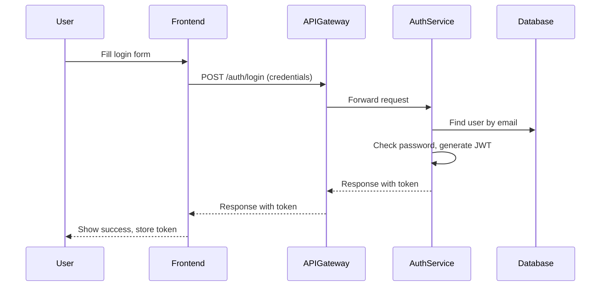

# User Login Flow (Medicart-FS)

This document explains in detail what happens when a user clicks the Login button from the frontend in the Medicart-FS project. It covers the flow from the frontend (React) through the API Gateway to the backend (Spring Boot Auth Service), with code snippets and beginner-friendly explanations for each step.

---

## 1. User Submits Login Form (Frontend)

When the user fills in their email and password and clicks Login, the frontend sends a POST request to the backend's `/auth/login` endpoint.

**File:** `frontend/src/api/authService.js`
```javascript
// Sends a login request to the backend
export function login({ email, password }) {
  // apiClient is an Axios instance configured with the API base URL
  return apiClient.post('/auth/login', {
    email,
    password,
  });
}
```
**Explanation:**
- The `login` function takes the user's email and password.
- It sends a POST request to `/auth/login` using Axios.
- The backend will handle authentication and respond with a JWT token if successful.

---

## 2. API Gateway Forwards the Request

The request first goes to the API Gateway, which routes it to the Auth Service.

**File:** `microservices/api-gateway/src/main/resources/application.properties` (or `application.yml`)
```properties
spring.cloud.gateway.routes[0].id=auth-service
spring.cloud.gateway.routes[0].uri=http://localhost:8081
spring.cloud.gateway.routes[0].predicates[0]=Path=/auth/**
```
**Explanation:**
- The API Gateway listens for requests matching `/auth/**`.
- It forwards these requests to the Auth Service running on port 8081.

---

## 3. Auth Service Handles Login (Backend)

### Controller Layer
**File:** `microservices/auth-service/src/main/java/com/medicart/auth/controller/AuthController.java`
```java
@PostMapping("/login")
public ResponseEntity<?> login(@RequestBody LoginRequest request) {
    try {
        LoginResponse response = authService.login(request);
        return ResponseEntity.ok(response);
    } catch (Exception e) {
        return ResponseEntity.badRequest().body(java.util.Map.of("error", e.getMessage()));
    }
}
```
**Explanation:**
- The `login` method handles POST requests to `/auth/login`.
- It receives a `LoginRequest` object (containing email and password).
- It calls the `authService.login()` method to perform authentication.
- If successful, it returns a `LoginResponse` with a JWT token and user info.
- If authentication fails, it returns an error message.

### Service Layer
**File:** `microservices/auth-service/src/main/java/com/medicart/auth/service/AuthService.java`
```java
public LoginResponse login(LoginRequest request) {
    // 1. Find user by email
    User user = userRepository.findByEmail(request.getEmail())
        .orElseThrow(() -> new RuntimeException("User not found"));
    // 2. Check password
    if (!passwordEncoder.matches(request.getPassword(), user.getPassword())) {
        throw new RuntimeException("Invalid password");
    }
    // 3. Generate JWT token
    String token = jwtService.generateToken(user);
    // 4. Return response
    return new LoginResponse(token, user.getId(), user.getEmail(), List.of(user.getRole().getName()));
}
```
**Explanation:**
- Finds the user in the database by email.
- Checks if the provided password matches the stored (hashed) password.
- If valid, generates a JWT token for the user.
- Returns a response containing the token and user info.

### JWT Token Generation
**File:** `microservices/auth-service/src/main/java/com/medicart/auth/service/JwtService.java`
```java
public String generateToken(User user) {
    return Jwts.builder()
        .setSubject(user.getEmail())
        .claim("userId", user.getId())
        .claim("role", user.getRole().getName())
        .setIssuedAt(new Date())
        .setExpiration(new Date(System.currentTimeMillis() + expiration))
        .signWith(secretKey, SignatureAlgorithm.HS256)
        .compact();
}
```
**Explanation:**
- Creates a JWT token containing the user's email, ID, and role.
- Sets the token's issue and expiration times.
- Signs the token with a secret key.

---

## 4. Response Sent Back to Frontend

**Example Response:**
```json
{
  "token": "<jwt-token>",
  "userId": 1,
  "email": "user@example.com",
  "roles": ["ROLE_USER"]
}
```
**Explanation:**
- The frontend receives the JWT token and user info.
- The token is stored (e.g., in localStorage) for future authenticated requests.

---

## 5. User is Now Logged In
- The frontend can now use the JWT token to access protected resources.
- The user is typically redirected to a dashboard or home page.

---

## Sequence Diagram


---

This document provides a complete, beginner-friendly explanation of the login process in Medicart-FS, with code and file paths for each step.
