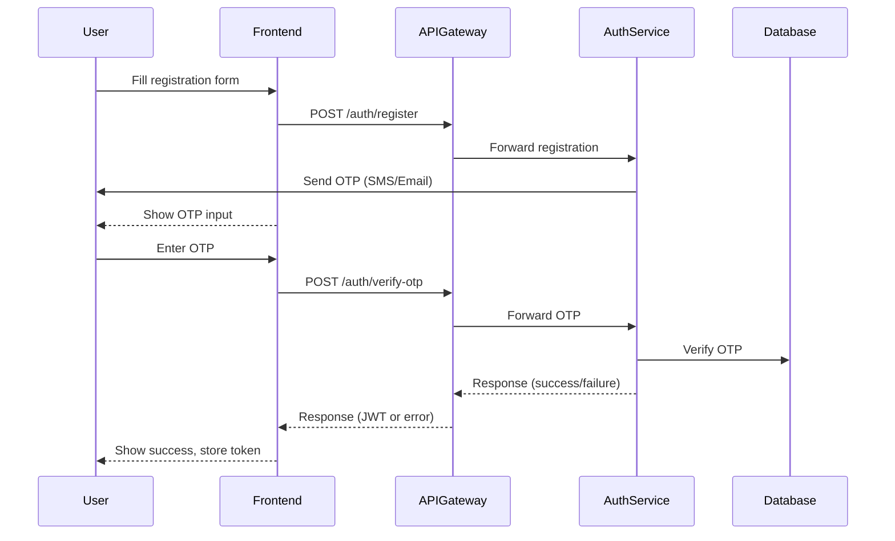

# OTP Verification in Registration Flow (Medicart-FS)

This document explains how OTP (One-Time Password) is integrated into the user registration process in the Medicart-FS project. It covers the flow from the frontend to the backend, including code snippets and beginner-friendly explanations.

---

## 1. User Submits Registration Form (Frontend)
- The user fills out the registration form (email, password, phone, etc.) and clicks Register.
- The frontend sends a POST request to `/auth/register`.
- The backend responds by sending an OTP to the user's phone/email and returns a response indicating that OTP verification is required.

---

## 2. OTP Sent to User
- The backend generates a random OTP (usually 4-6 digits).
- The OTP is sent to the user's phone (via SMS) or email.
- The OTP is temporarily stored in the backend (in-memory, cache, or database) associated with the user's registration attempt.

---

## 3. Frontend Prompts for OTP
- The frontend displays an OTP input form to the user.
- The user enters the OTP they received.
- The frontend sends a POST request to `/auth/verify-otp` with the OTP and user identifier (email/phone).

**File:** `frontend/src/api/authService.js`
```javascript
// Called after user submits OTP
export function verifyOtp({ email, otp }) {
  return apiClient.post('/auth/verify-otp', {
    email,
    otp,
  });
}
```
**Explanation:**
- The `verifyOtp` function sends the entered OTP and email to the backend for verification.

---

## 4. Backend Verifies OTP
- The backend receives the OTP and user identifier.
- It checks if the OTP matches the one generated for that user.
- If valid, the user account is activated and a JWT token is generated.
- If invalid, an error is returned.

**File:** `microservices/auth-service/src/main/java/com/medicart/auth/controller/AuthController.java`
```java
@PostMapping("/verify-otp")
public ResponseEntity<?> verifyOtp(@RequestBody OtpRequest request) {
    boolean isValid = authService.verifyOtp(request.getEmail(), request.getOtp());
    if (isValid) {
        // Generate JWT and return success
        User user = userRepository.findByEmail(request.getEmail()).orElseThrow();
        String token = jwtService.generateToken(user);
        return ResponseEntity.ok(new LoginResponse(token, user.getId(), user.getEmail(), List.of(user.getRole().getName())));
    } else {
        return ResponseEntity.badRequest().body(Map.of("error", "Invalid OTP"));
    }
}
```
**Explanation:**
- The controller receives the OTP and email.
- Calls the service to verify the OTP.
- If valid, generates a JWT and returns user info.
- If invalid, returns an error.

---

## 5. User is Now Registered and Logged In
- On successful OTP verification, the frontend receives the JWT token and user info.
- The user is now fully registered and logged in.

---

## Sequence Diagram


---

This document provides a complete, beginner-friendly explanation of the OTP verification step in the registration process, with code and file paths for each step.
