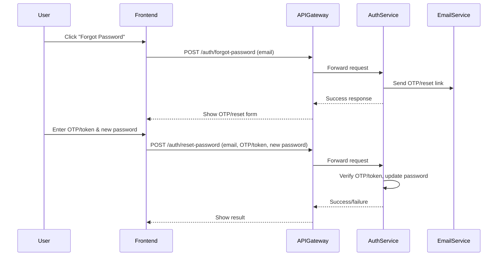
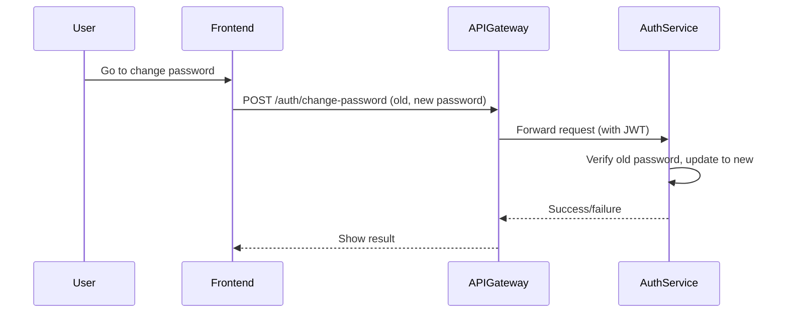

# Forgot Password & Change Password Flow (Medicart-FS)

This document explains the complete flow for both "Forgot Password" and "Change Password" features in the Medicart-FS project. It covers the frontend, API Gateway, and backend logic, with code snippets and beginner-friendly explanations.

---

## 1. Forgot Password Flow

### Step-by-Step
1. **User clicks "Forgot Password" on the login page.**
2. **Frontend shows a form to enter the registered email address.**
3. **User submits their email.**
4. **Frontend sends a POST request to `/auth/forgot-password` with the email.**
5. **Backend generates an OTP or reset token and sends it to the user's email (or phone).**
6. **Frontend prompts the user to enter the OTP or reset token.**
7. **User enters the OTP/token and a new password.**
8. **Frontend sends a POST request to `/auth/reset-password` with the email, OTP/token, and new password.**
9. **Backend verifies the OTP/token and updates the password if valid.**
10. **User can now log in with the new password.**

---

### Sequence Diagram


---

### Key Code Snippets

#### 1. Frontend API Calls (React)
**File:** `frontend/src/api/authService.js`
```javascript
export function forgotPassword(email) {
  return apiClient.post('/auth/forgot-password', { email });
}

export function resetPassword({ email, otp, newPassword }) {
  return apiClient.post('/auth/reset-password', {
    email,
    otp,
    newPassword,
  });
}
```

#### 2. API Gateway Route
**File:** `microservices/api-gateway/src/main/resources/application.properties`
```properties
spring.cloud.gateway.routes[0].id=auth-service
spring.cloud.gateway.routes[0].uri=http://localhost:8081
spring.cloud.gateway.routes[0].predicates[0]=Path=/auth/**
```

#### 3. Backend Endpoints (Spring Boot)
**File:** `microservices/auth-service/src/main/java/com/medicart/auth/controller/AuthController.java`
```java
@PostMapping("/forgot-password")
public ResponseEntity<?> forgotPassword(@RequestBody ForgotPasswordRequest request) {
    authService.sendResetOtp(request.getEmail());
    return ResponseEntity.ok(Map.of("message", "OTP sent to your email"));
}

@PostMapping("/reset-password")
public ResponseEntity<?> resetPassword(@RequestBody ResetPasswordRequest request) {
    boolean success = authService.resetPassword(request.getEmail(), request.getOtp(), request.getNewPassword());
    if (success) {
        return ResponseEntity.ok(Map.of("message", "Password reset successful"));
    } else {
        return ResponseEntity.badRequest().body(Map.of("error", "Invalid OTP or expired"));
    }
}
```

---

## 2. Change Password Flow (User is Logged In)

### Step-by-Step
1. **User is logged in and goes to the change password page.**
2. **Frontend shows a form for old password and new password.**
3. **User submits the form.**
4. **Frontend sends a POST request to `/auth/change-password` with old and new passwords (and JWT in headers).**
5. **Backend verifies the old password and updates to the new password if correct.**
6. **User receives a success or error message.**

---

### Sequence Diagram


---

### Key Code Snippets

#### 1. Frontend API Call
**File:** `frontend/src/api/authService.js`
```javascript
export function changePassword({ oldPassword, newPassword }) {
  return apiClient.post('/auth/change-password', {
    oldPassword,
    newPassword,
  });
}
```

#### 2. Backend Endpoint
**File:** `microservices/auth-service/src/main/java/com/medicart/auth/controller/AuthController.java`
```java
@PostMapping("/change-password")
public ResponseEntity<?> changePassword(@RequestBody ChangePasswordRequest request, @RequestHeader("Authorization") String authHeader) {
    boolean success = authService.changePassword(request, authHeader);
    if (success) {
        return ResponseEntity.ok(Map.of("message", "Password changed successfully"));
    } else {
        return ResponseEntity.badRequest().body(Map.of("error", "Old password incorrect"));
    }
}
```

---

## Summary Table
| Flow | Endpoint | Description |
|------|----------|-------------|
| Forgot Password | /auth/forgot-password | User requests OTP/token for password reset |
| Reset Password | /auth/reset-password | User submits OTP/token and new password |
| Change Password | /auth/change-password | Logged-in user changes password |

---

This document provides a complete, beginner-friendly explanation of the forgot password and change password flows in Medicart-FS, with code and file paths for each step.
