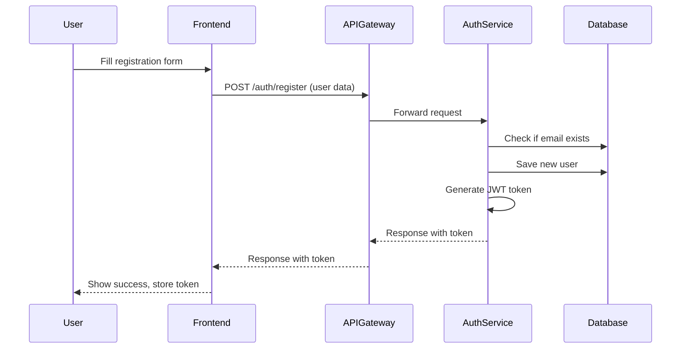

# What Happens When a User Registers?

This section explains the complete flow that occurs in the Medicart project when a new user registers (signs up) through the frontend.

---

## 1. User Submits Registration Form
- The user fills out the registration form in the frontend (React app).
- Typical fields: email, password, full name, phone number.
- The frontend sends a POST request to the backend:
  - **Endpoint:** `POST /auth/register`
  - **Body:** `{ "email": "user@example.com", "password": "pass123", "fullName": "John", "phone": "1234567890" }`

---

## 2. API Gateway Receives the Request
- The request first hits the **API Gateway** (Spring Cloud Gateway).
- The gateway routes the request to the **auth-service** (authentication microservice).

---

## 3. Auth Service Handles Registration
- The `/auth/register` endpoint in the **AuthController** receives the request.
- The controller calls the `register()` method in **AuthService**.
- **AuthService** does the following:
  1. **Checks if the email already exists** in the database.
  2. **Encrypts the password** using BCrypt for security.
  3. **Creates a new User entity** with the provided details.
  4. **Assigns the ROLE_USER** to the new user.
  5. **Saves the user** to the database.
  6. **Generates a JWT token** for the user (using JwtService).
  7. **Returns a response** with the JWT token and user info.

---

## 4. Response Sent Back
- The Auth Service sends a response back to the frontend via the API Gateway.
- **Response Example:**
```json
{
  "token": "<jwt-token>",
  "userId": 1,
  "email": "user@example.com",
  "roles": ["ROLE_USER"]
}
```
- The frontend stores the JWT token (usually in localStorage) for future authenticated requests.

---

## 5. User is Now Registered and Logged In
- The user is now registered in the system and can use the token to access protected resources.
- The frontend may redirect the user to a dashboard or welcome page.

---

## Sequence Diagram


---

## Summary Table
| Step | Who | What Happens |
|------|-----|--------------|
| 1 | User/Frontend | User submits registration form |
| 2 | API Gateway | Routes request to auth-service |
| 3 | Auth Service | Validates, creates user, generates JWT |
| 4 | API Gateway | Returns response to frontend |
| 5 | Frontend | Stores token, user is logged in |

---

## Key Code Snippets and File Paths

### 1. Registration Endpoint (Controller)
**File:** `microservices/auth-service/src/main/java/com/medicart/auth/controller/AuthController.java`
```java
@PostMapping("/register")
public ResponseEntity<?> register(@RequestBody RegisterRequest request) {
    try {
        LoginResponse response = authService.register(request);
        return ResponseEntity.ok(response);
    } catch (Exception e) {
        return ResponseEntity.badRequest().body(java.util.Map.of("error", e.getMessage()));
    }
}
```

### 2. Registration Logic (Service)
**File:** `microservices/auth-service/src/main/java/com/medicart/auth/service/AuthService.java`
```java
public LoginResponse register(RegisterRequest request) {
    // 1. Check if email already exists
    if (userRepository.findByEmail(request.getEmail()).isPresent()) {
        throw new RuntimeException("Email already registered");
    }
    // 2. Encrypt password
    String encodedPassword = passwordEncoder.encode(request.getPassword());
    // 3. Create new User entity
    User user = User.builder()
        .email(request.getEmail())
        .password(encodedPassword)
        .fullName(request.getFullName())
        .phone(request.getPhone())
        .isActive(true)
        .role(roleRepository.findByName("ROLE_USER").orElseThrow())
        .build();
    // 4. Save user
    userRepository.save(user);
    // 5. Generate JWT token
    String token = jwtService.generateToken(user);
    // 6. Return response
    return new LoginResponse(token, user.getId(), user.getEmail(), List.of(user.getRole().getName()));
}
```

### 3. JWT Generation (Service)
**File:** `microservices/auth-service/src/main/java/com/medicart/auth/service/JwtService.java`
```java
public String generateToken(User user) {
    return Jwts.builder()
        .setSubject(user.getEmail())
        .claim("userId", user.getId())
        .claim("role", user.getRole().getName())
        .setIssuedAt(new Date())
        .setExpiration(new Date(System.currentTimeMillis() + expiration))
        .signWith(secretKey, SignatureAlgorithm.HS256)
        .compact();
}
```

---

## Why Do We Use JWT in Registration?

When a user registers, we immediately generate a JWT (JSON Web Token) and return it to the frontend. Here’s why:

- **Instant Authentication:**
  - The user is automatically logged in after registration. No need for a separate login step.
  - The JWT acts as a proof of identity for the user.

- **Stateless Security:**
  - JWT is a secure, stateless way to represent user identity and claims (like userId, role).
  - The backend does not need to store session data; the token itself contains all necessary info.

- **Access Control:**
  - The JWT includes userId and role, so the frontend can use it to access protected resources immediately.
  - The API Gateway and microservices can validate the token and extract user info for authorization.

- **Seamless User Experience:**
  - The frontend stores the JWT and uses it for all future requests.
  - The user can access their dashboard, profile, and other features right after registering.

- **Security:**
  - The JWT is signed with a secret key, so it cannot be tampered with.
  - Only the backend can generate valid tokens; the gateway and services can verify them.

**Summary:**
> We use JWT in registration to provide instant, secure authentication and authorization for the user, enabling a seamless and stateless login experience right after signup.

---

## Key Code Snippets and File Paths (Frontend, Gateway, Backend)

### 1. Frontend Registration Code (React)
**File:** `frontend/src/api/authService.js`
```javascript
import apiClient from './client';

export function register({ email, password, fullName, phone }) {
  return apiClient.post('/auth/register', {
    email,
    password,
    fullName,
    phone,
  });
}
```
- This function is called when the user submits the registration form.
- It sends a POST request to `/auth/register` using the shared Axios client.

**File:** `frontend/src/api/client.js`
```javascript
import axios from 'axios';

const apiClient = axios.create({
  baseURL: 'http://localhost:8080', // API Gateway URL
});

export default apiClient;
```
- All frontend API calls go through the API Gateway at port 8080.

---

### 2. API Gateway Route (Spring Cloud Gateway)
**File:** `microservices/api-gateway/src/main/resources/application.properties` (or `application.yml`)
```properties
spring.cloud.gateway.routes[0].id=auth-service
spring.cloud.gateway.routes[0].uri=http://localhost:8081
spring.cloud.gateway.routes[0].predicates[0]=Path=/auth/**
```
- This configures the gateway to forward all `/auth/**` requests to the auth-service on port 8081.

**File:** `microservices/api-gateway/src/main/java/com/medicart/gateway/ApiGatewayApplication.java`
```java
@SpringBootApplication
public class ApiGatewayApplication {
    public static void main(String[] args) {
        SpringApplication.run(ApiGatewayApplication.class, args);
    }
}
```
- The gateway application runs and handles routing for all microservices.

---

### 3. Backend Registration Endpoint (Spring Boot)
(See previous code snippets for `AuthController.java` and `AuthService.java`)

---

These code snippets show the full path: from the frontend registration form, through the API Gateway, to the backend registration logic.

---

This flow ensures secure, seamless registration and immediate login for new users in the Medicart system.
