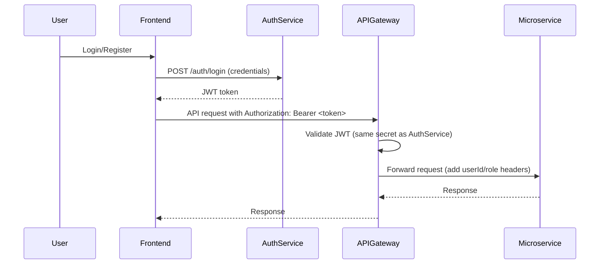

# How JWT in API Gateway and Auth Service Work Together

## Overview
This document explains how JWT (JSON Web Token) authentication is integrated between the API Gateway and the Auth Service in the Medicart microservices project. It covers the flow of token creation, validation, and propagation, and how both services work together to secure the system.

---

## 1. What is JWT?
JWT (JSON Web Token) is a compact, URL-safe means of representing claims to be transferred between two parties. In Medicart, JWT is used for stateless authentication.

---

## 2. Where is the JWT Created?
- **JWT is created in the Auth Service.**
- When a user logs in or registers, the Auth Service generates a JWT containing user information (userId, email, role, etc.) and signs it with a secret key.
- The token is returned to the frontend (React app), which stores it (usually in localStorage).

---

## 3. How is the JWT Used by the Gateway?
- The frontend sends the JWT in the `Authorization: Bearer <token>` header with every API request.
- The API Gateway receives the request and extracts the JWT from the header.
- The Gateway **validates** the JWT using the same secret key as the Auth Service (configured in both services).
- If the token is valid, the Gateway extracts claims (like userId, role) and can add them as headers (e.g., `X-User-Id`) for downstream microservices.
- If the token is invalid or missing, the Gateway rejects the request (401 Unauthorized).

---

## 4. Why Use the Same Secret Key?
- Both the Auth Service and the API Gateway must use the **same JWT secret** so that the Gateway can verify tokens issued by the Auth Service.
- This ensures that only tokens generated by your Auth Service are accepted by the Gateway.

---

## 5. Code Flow Example

### Auth Service (Token Generation)
```java
// AuthService.java
String token = jwtService.generateToken(user); // user info encoded in JWT
```

### Gateway (Token Validation)
```java
// JwtAuthenticationFilter.java (in API Gateway)
Jws<Claims> claims = Jwts.parserBuilder()
    .setSigningKey(secretKey)
    .build()
    .parseClaimsJws(token); // Validates and parses JWT
```

---

## 6. Sequence Diagram


---

## 7. Summary Table
| Step | Who | What Happens |
|------|-----|--------------|
| 1 | Auth Service | Issues JWT after login/register |
| 2 | Frontend | Stores and sends JWT with requests |
| 3 | API Gateway | Validates JWT, extracts claims |
| 4 | Microservices | Trust user info from Gateway headers |

---

## 8. Security Note
- Never share the JWT secret publicly.
- Only the Auth Service should issue tokens; only the Gateway should validate them for incoming requests.
- Downstream microservices should trust the Gateway, not validate JWTs themselves.

---

## 9. References
- [JWT.io Introduction](https://jwt.io/introduction)
- [Spring Security JWT Guide](https://www.baeldung.com/spring-security-oauth-jwt)

---

This setup ensures secure, stateless authentication across all your microservices using a single source of truth for user identity.
